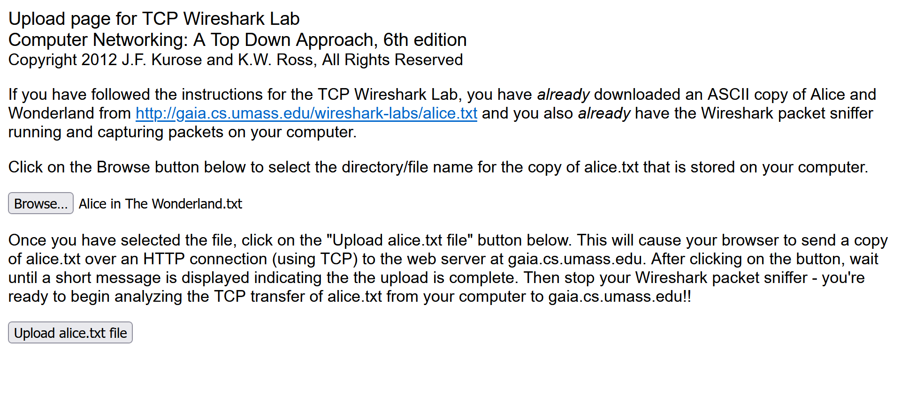
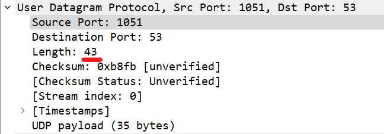
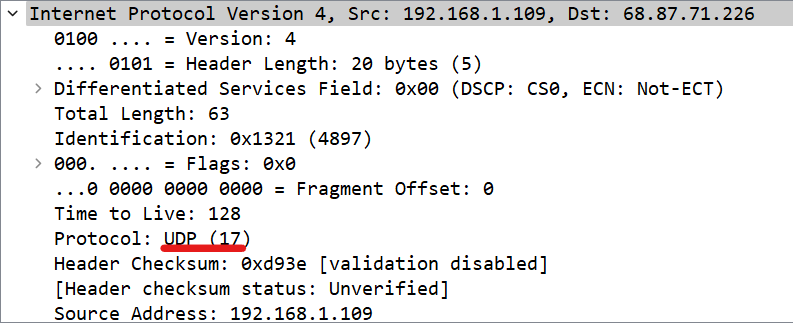
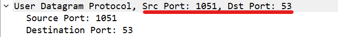
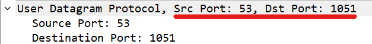

# Wireshark TCP & UDP Jarkom Assignment

<table>
<tbody>
  <thead>
    <tr>
      <th>Name</th>
      <th>NRP</th>
    </tr>
  </thead>
  <tbody>
    <tr>
      <td>Yehezkiel Wiradhika</td>
      <td>5025201086</td>
    </tr>
  </tbody>
</table>

## Wireshark TCP

### Capturing the packets

- First, we have to download the file from http://gaia.cs.umass.edu/wiresharklabs/alice.txt and retrieve an ASCII copy of Alice in Wonderland. Store this as a .txt file somewhere in our computer.
- Go to http://gaia.cs.umass.edu/wireshark-labs/TCP-wireshark-file1.html.
- We should see something like this
  
- We then Browse button in this form to the file on our computer that we just
  created containing Alice in Wonderland. Don’t press the “Upload alice.txt file”
  button yet.
- Now, we start up Wireshark and begin capturing packets
  
- Returning to our browser, press the “Upload alice.txt file” button to upload the
  file to the gaia.cs.umass.edu server. Once the file has been uploaded, a short
  congratulations message will be displayed in your browser window.
  
- Stop Wireshark packet capture

### Questions and Answers

1. What is the IP address and TCP port number used by the client computer (source)
   that is transferring the alice.txt file to gaia.cs.umass.edu?

   First, we have to filter <code>http</code> in our wireshark display filter

   

   Here, we can see that the source IP address of the client computer is <code>192.168.18.17</code> and we know this because the packet containing the source IP is doing a POST request (uploading the file).

   We can see the source port in the details of the TCP packet header window

   

   Here, we can see that the source port is <code>50229</code>

2. What is the IP address of gaia.cs.umass.edu? On what port number is it sending
   and receiving TCP segments for this connection?

   

   Here, we can see that the packet is sending (bc it uses the POST method) the file alice.txt and the destination is gaia.cs.umass.edu. We can see here that the IP of the destination is <code>128.119.245.12</code>. We can see the port when the POST of the file happened in the _TCP header details_

   

   Here, we can see that the destination PORT (port that is receiving the TCP packet for gaia.cs.umass.edu) is <code>port 80</code>, then if we see the TCP details of the response packet

   

   We can see that the source PORT (port that is sending the response for gaia.cs.umass.edu) is <code>port 80</code>

3. What is the sequence number of the TCP SYN segment that is used to initiate the
   TCP connection between the client computer and gaia.cs.umass.edu?

   We can filter first with the keyword <code>tcp</code> then search for packets with _SYN_ type and source IP of client (our computer) with destination IP of _gaia.cs.umass.edu_

   

   We can see in the packet containing the SYN (in the TCP details)

   

   There (in the highlighted area), you can see the raw TCP sequence number.

4. What is the sequence number of the SYNACK segment sent by gaia.cs.umass.edu
   to the client computer in reply to the SYN? What is it in the segment that
   identifies the segment as a SYNACK segment? What is the value of the
   Acknowledgement field in the SYNACK segment? How did gaia.cs.umass.edu
   determine that value?

   We select the packet that is of type _SYN, ACK_ which has the destination IP of the client and the source IP of _gaia.cs.umass.edu_

   

   We can find the sequence number and acknowledgement field value of SYNACK segment in the TCP details

   

   in the segment, if we follow the TCP stream, it contains the content of alice.txt

   

   _gaia.cs.umass.edu_ determined the value by using ports and request header from the client that dictates the types and values also other configs in the server&apos;s api

5. What is the sequence number of the TCP segment containing the header of the
   HTTP POST command? How many bytes of data are contained in the payload (data) field of this TCP segment? Did all of the data in the transferred file alice.txt fit into this single segment?

   We can see the sequence number in the packet's tcp details

    

   the size (bytes of data) contained in the payload, we can see in the HTTP details response
   

   All of the data in the transferred file alice.txt doesn't fit in a single segment

   

   rather its disassembled into 109 segments

6. Consider the TCP segment containing the HTTP “POST” as the first segment in
   the data transfer part of the TCP connection.

   - At what time was the first segment (the one containing the HTTP POST) in
     the data-transfer part of the TCP connection sent?
     
   - At what time was the ACK for this first data-containing segment received?
     
   - What is the RTT for this first data-containing segment?
     
   - What is the RTT value the second data-carrying TCP segment and its ACK?
     
   - What is the EstimatedRTT value (see Section 3.5.3, in the text) after the
     ACK for the second data-carrying segment is received? Assume that in
     making this calculation after the received of the ACK for the second segment, that the initial value of EstimatedRTT is equal to the measured RTT for the
     first segment, and then is computed using the EstimatedRTT equation on
     page 242, and a value of alpha = 0.125.

7. What is the length (header plus payload) of each of the first four data-carrying
   TCP segments?
8. What is the minimum amount of available buffer space advertised to the client by
   gaia.cs.umass.edu among these first four data-carrying TCP segments? Does the
   lack of receiver buffer space ever throttle the sender for these first four data carrying segments?
9. Are there any retransmitted segments in the trace file? What did you check for (in
   the trace) in order to answer this question?
10. How much data does the receiver typically acknowledge in an ACK among the
    first ten data-carrying segments sent from the client to gaia.cs.umass.edu? Can
    you identify cases where the receiver is ACKing every other received segment
    (see Table 3.2 in the text) among these first ten data-carrying segments?
11. What is the throughput (bytes transferred per unit time) for the TCP connection?
    Explain how you calculated this value.
12. Use the Time-Sequence-Graph(Stevens) plotting tool to view the sequence
    number versus time plot of segments being sent from the client to the
    gaia.cs.umass.edu server. Consider the “fleets” of packets sent around t = 0.025, t = 0.053, t = 0.082 and t = 0.1. Comment on whether this looks as if TCP is in its slow start phase, congestion avoidance phase or some other phase. Figure 6 shows a slightly different view of this data.
13. These “fleets” of segments appear to have some periodicity. What can you say
    about the period?
14. Answer each of two questions above for the trace that you have gathered when
    you transferred a file from your computer to gaia.cs.umass.edu

## Wireshark UDP

### Capture UDP packet

Here, we just download the captured datas from http://gaia.cs.umass.edu/wireshark-labs/wireshark-traces-8.1.zip

### Questions and answers

1. Select the first UDP segment in your trace. What is the packet number of this
   segment in the trace file? What type of application-layer payload or protocol
   message is being carried in this UDP segment? Look at the details of this packet
   in Wireshark. How many fields there are in the UDP header? (You shouldn’t
   look in the textbook! Answer these questions directly from what you observe in
   the packet trace.) What are the names of these fields?

   a. Select the first UDP segment in your trace

   First, we just display filter <code>udp</code> in our display filter query form

   

   Here, the highlighted packet is the first UDP segment

   

   b. What is the packet number of this segment in the trace file?

   

   packet number is 470

   c. What type of application-layer payload or protocol message is being carried in this UDP segment?

   

   the payload type is DNS payload and the content is gaia.cs.umass.edu

   d. Look at the details of this packet in Wireshark. How many fields there are in the UDP header?

   

   There are 4 fields:

   - source port
   - destination port
   - length
   - checksum

2. By consulting the displayed information in Wireshark’s packet content field for
   this packet (or by consulting the textbook), what is the length (in bytes) of each of the UDP header fields?

   

   The length is 43 - 35 (because 35 is size of the payload), meaning the header's size is 8 bytes

3. The value in the Length field is the length of what? (You can consult the text for
   this answer). Verify your claim with your captured UDP packet.

   The length of UDP header including the payload (from pic number 2)

4. What is the maximum number of bytes that can be included in a UDP payload?
   (Hint: the answer to this question can be determined by your answer to 2. above)

   The maximum size of a User Datagram Protocol (UDP) payload can vary depending on the specific network and system configurations. However, the theoretical maximum size of a UDP packet, including its payload and header, is 65,535 bytes

5. What is the largest possible source port number? (Hint: see the hint in 4.)

   The largest possible source port number in a UDP packet is 65,535. This is because the source port field in the UDP header is a 16-bit field, which means it can represent values from 0 to 65,535.

6. What is the protocol number for UDP? Give your answer in decimal notation. To
   answer this question, you’ll need to look into the Protocol field of the IP datagram containing this UDP segment (see Figure 4.13 in the text, and the discussion of IP header fields).

   

   The protocol number for UDP (User Datagram Protocol) in decimal notation is 17.

7. Examine the pair of UDP packets in which your host sends the first UDP packet
   and the second UDP packet is a reply to this first UDP packet. (Hint: for a second
   packet to be sent in response to a first packet, the sender of the first packet should be the destination of the second packet). What is the packet number of the first of these two UDP segments in the trace file? What is the packet number
   of the second of these two UDP segments in the trace file? Describe the relationship between the port numbers in the two packets.

   a. Examine the pair of UDP packets in which your host sends the first UDP packet
   and the second UDP packet is a reply to this first UDP packet.

   

   The packet is a pair because the destination and source IP matches between the 2 packets

   b. What is the packet number of the first of these two UDP segments in the trace file? What is the packet number of the second of these two UDP segments in the trace file?

   

   packet number of the first one is 470 while the second one is 472

   c. Describe the relationship between the port numbers in the two packets.

   

   When the first packet sends the data, the data is sent using port 1051 while the second packet receives the data using port 53 (DNS port), meaning the first packet is asking for DNS port to the second packet

   

   in the second packet, the source the server that serves DNS sends the result on port 53 and the client requesting, receives the packet on port 1051
